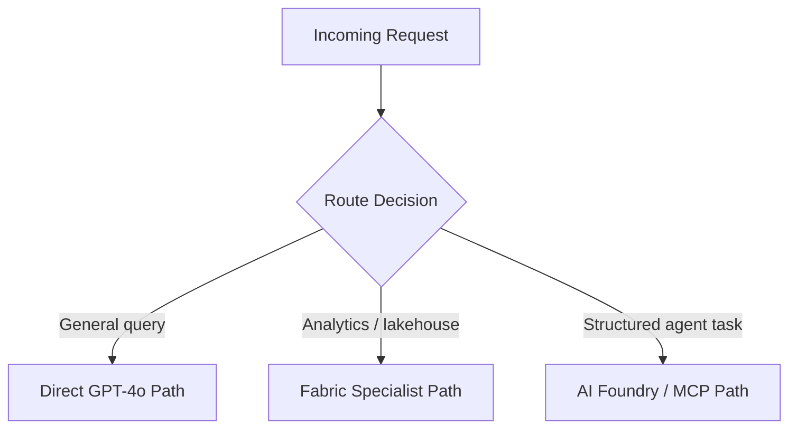
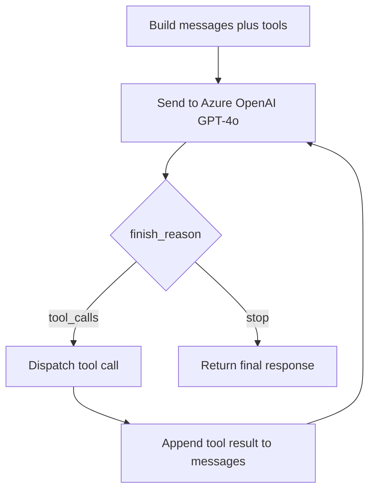
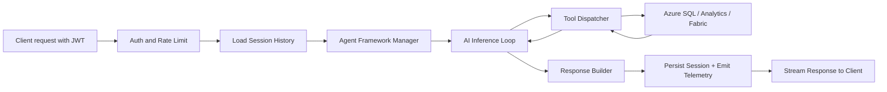
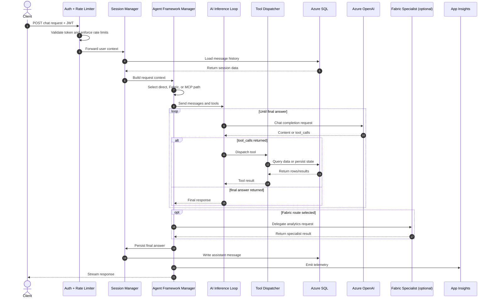

# Azure Intelligent Agent — Architecture Documentation

> **Repo:** `kellandamm/azure-intelligent-agent`  
> **Last updated:** April 2026

---

## Table of Contents

1. [Agent Architecture Overview](#agent-architecture-overview)
2. [Key Components](#key-components)
3. [App Flow](#app-flow)
4. [Data Flow](#data-flow)
5. [Multi-Agent Sequence](#multi-agent-sequence)
6. [Azure Services](#azure-services)

---

## Agent Architecture Overview

The system is a **FastAPI-based intelligent agent** deployed on Azure App Service. It uses GPT-4o function calling in a looped inference pattern, with optional delegation to specialist agents running on Microsoft Fabric or Azure AI Foundry. Every secret is pulled from Key Vault via Managed Identity, and every SQL query runs through a VNet private endpoint with Row-Level Security (RLS).

```mermaid
flowchart TB
    Client[Client Browser / API] --> Auth[Auth + Rate Limiter]
    Auth --> Session[Session Manager]
    Session --> AgentMgr[Agent Framework Manager]

    AgentMgr --> AILoop[AI Inference Loop]
    AILoop --> Tools[Tool Dispatcher]
    Tools --> SQL[Azure SQL Database]
    SQL --> Tools
    Tools --> AILoop
    AILoop --> Response[Response Builder]
    Response --> Client

    AgentMgr -. optional .-> Fabric[Microsoft Fabric Specialist]
    AgentMgr -. optional .-> Foundry[Azure AI Foundry / MCP]

    KV[Azure Key Vault] --> AgentMgr
    Telemetry[Application Insights] <-- Response
```

---

## Key Components

### 1. Auth & Rate Limiter (`auth_service.py`, `rate_limiter.py`)

| Responsibility | Detail |
|---|---|
| JWT validation | Decodes and verifies Azure AD (Entra ID) Bearer tokens |
| RBAC enforcement | Maps `roles[]` to allowed capabilities |
| Per-user rate limiting | Prevents OpenAI cost runaway |
| Request enrichment | Builds `user_context` for downstream services |

### 2. Session Manager (`chat_service.py`)

| Responsibility | Detail |
|---|---|
| Session hydration | Reads `message_history[]` from Azure SQL |
| Token budget management | Trims oldest turns when needed |
| Session persistence | Writes final assistant turn back to SQL |
| In-memory cache | Avoids repeated SQL round-trips |
| Tenant isolation | Uses RLS so users only see their own history |

### 3. Agent Framework Manager (`agent_framework_manager.py`)

The **central router** that chooses one of three execution paths:



### 4. AI Inference Loop

The GPT-4o function-calling loop runs until a final response is produced.



### 5. Tool Dispatcher (`agent_tools.py`)

| Tool | Action |
|---|---|
| `query_sql` | Runs RLS-scoped T-SQL via private endpoint |
| `get_sales_data` | Calls sales analytics routes |
| `query_fabric` | Calls Fabric REST API (optional) |
| `get_analytics` | Calls analytics service |
| `embed_report` | Generates Power BI embed token (optional) |

### 6. Secret Resolver (`config.py` + Key Vault)

- Uses `DefaultAzureCredential` and Managed Identity.
- Pulls OpenAI, SQL, Fabric, and app configuration secrets.
- Keeps credentials out of source code.

### 7. MCP Server (`mcp_server_app.py`)

When `RUN_MODE=mcp`, the app exposes MCP routes and acts as a callable specialist tool for Azure AI Foundry or Claude Desktop.

---

## App Flow



---

## Data Flow

### Data Flows Summary

| Flow | From → To | Data |
|---|---|---|
| F1 | Client → Auth | Message, conversation ID, JWT |
| F2 | Azure AD → Auth | User ID, roles, tenant ID |
| F3 | Auth → Session | User context, rate-limit state |
| F4 | Session → Agent Manager | Session ID, message history, token count |
| F5 | Agent Manager → Tool Dispatcher | Tool name, parameters, call ID |
| F6 | Agent Manager → AI Loop | Messages, tools, model config |
| F7 | AI Loop → Azure OpenAI | Chat completion request |
| F8 | Azure OpenAI → AI Loop | Content deltas, tool calls, finish reason |
| F9 | Tool Dispatcher → Azure SQL | T-SQL queries via private endpoint |
| F10 | Key Vault → Secret Resolver | API keys, connection strings |
| F11 | Response Builder → App Insights | Traces, metrics, token usage |

### Data Stores

| Store | Purpose | Example Contents |
|---|---|---|
| Azure SQL Database | Persistent conversation and app data | sessions, message_history, user metadata, RLS policies |
| Session Cache | Temporary in-memory state | active sessions, recent turns, rate-limit counters |
| Azure Key Vault | Secure configuration | OpenAI key, SQL connection string, Fabric token |

---

## Multi-Agent Sequence

See also: [`SEQUENCE_DIAGRAM.md`](./SEQUENCE_DIAGRAM.md)



---

## Azure Services

| Service | Role | Required |
|---|---|---|
| Azure App Service | Hosts FastAPI/Gunicorn | Yes |
| Azure OpenAI GPT-4o | Inference and function calling | Yes |
| Azure SQL Database | Sessions, history, business data | Yes |
| Azure Key Vault | Secrets via Managed Identity | Yes |
| Application Insights | Metrics, traces, diagnostics | Yes |
| Azure VNet + Private Endpoint | Private SQL access | Yes |
| Azure AD / Entra ID | JWT auth and RBAC | Yes |
| Microsoft Fabric | Specialist analytics path | Optional |
| Azure AI Foundry | MCP-based orchestration | Optional |
| Power BI Embedded | Inline report rendering | Optional |

---

This version is fully **GitHub-native** and uses Mermaid for diagrams so it renders directly in the repository UI.
